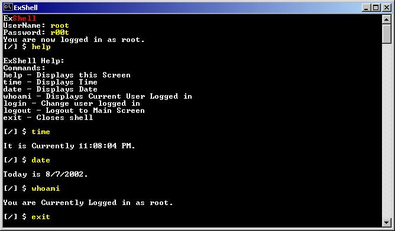



## ExShell

### Description

Teach Programmers the wonders of formless projects and command line programming... to get ready for more low level languages.. Learning Kernel Calls is important if you plan to learn alot of API... plus i have never seen any thing like this on Free source sites...
 
### More Info
 

             |
---                |---
**Submitted On**   |2002-08-07 23:32:04
**By**             |[Paul Green](https://github.com/Planet-Source-Code/PSCIndex/blob/master/ByAuthor/paul-green.md)
**Level**          |Advanced
**User Rating**    |4.8 (144 globes from 30 users)
**Compatibility**  |VB 6\.0
**Category**       |[Windows API Call/ Explanation](https://github.com/Planet-Source-Code/PSCIndex/blob/master/ByCategory/windows-api-call-explanation__1-39.md)
**World**          |[Visual Basic](https://github.com/Planet-Source-Code/PSCIndex/blob/master/ByWorld/visual-basic.md)
**Archive File**   |[ExShell115565882002\.zip](https://github.com/Planet-Source-Code/paul-green-exshell__1-37721/archive/master.zip)

### API Declarations

Kernel32.Dll

